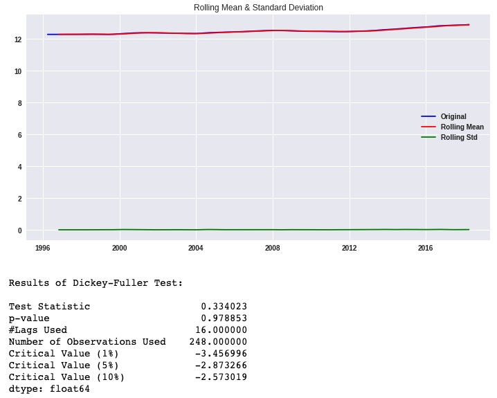
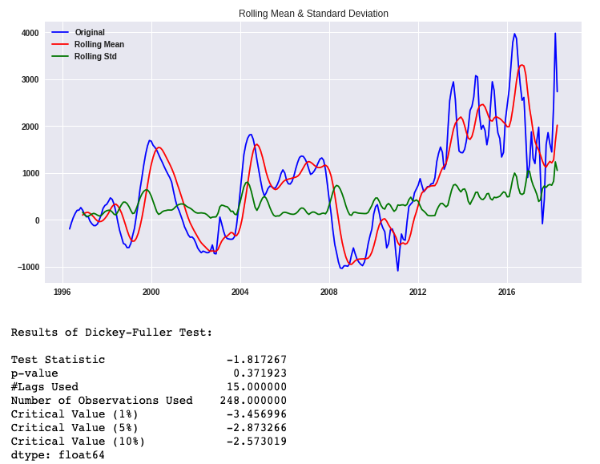
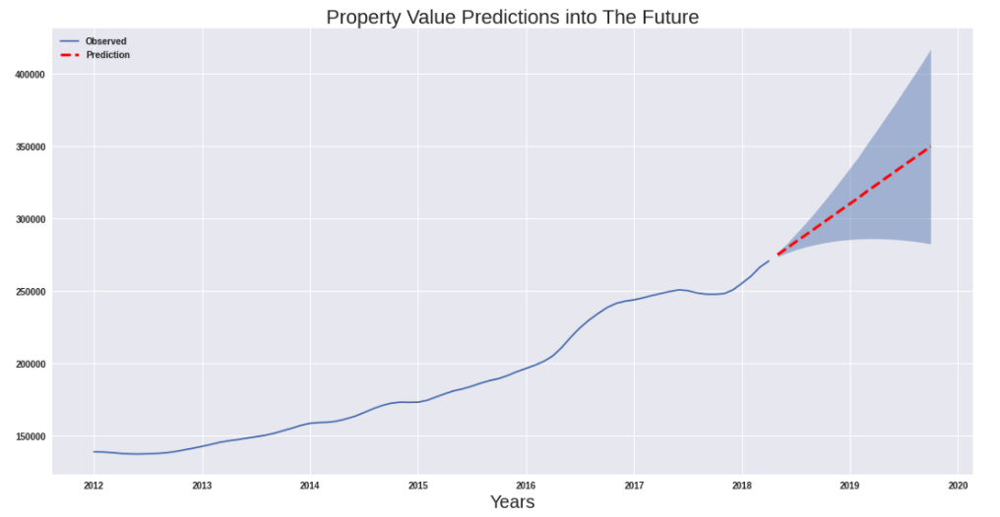
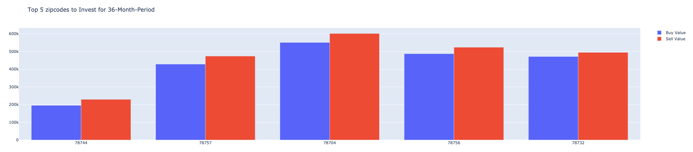

 # PROPERTY VALUE PREDICTIONS
 

 ## Introduction

Forecast real estate prices of various zip codes using data from [Zillow](https://www.zillow.com/research/data/). However, this won't be as straightforward as just running a time-series analysis -- we are going to have to make some data-driven decisions and think critically along the way!

For this project, we will be acting as a consultant for a fictional real-estate investment firm. The firm has asked us what seems like a simple question:

> What are the top 5 best zip codes for us to invest in?

This may seem like a simple question at first glance, but there's more than a little ambiguity here that we'll have to think through in order to provide a solid recommendation. Should our recommendation be focused on profit margins only? What about risk? What sort of time horizon are you predicting against?  Our recommendation will detail our rationale and answer any sort of lingering questions like these in order to demonstrate how we define "best".

 ## Objectives

* Explore data via visualizations and statistical analysis
* Create a times series for modeling
* Check data for trends & seasonality and decomposition
* Create a model with selected p,d,q parameters for base model
* Property price predictions for a single zipcode
* Property price predictions for the determined dataset
* Making recommendations based on investment period

 ### Explore data via visualizations and statistical analysis 
 

We observe from the plot above top 5 states with the most zipcodes:
1. CA
2. NY
3. TX
4. PA
5. FL

Our company is interested in investing in Austin, TEXAS area. We will subset our data set before we start examination with exploratory data analysis.

***Initial Observations:***
*   This dataset represent information on single family residential property sales between **1996 April** and **2018 April**.
*   There are 14723  different zipcodes included in the dataset.  
*   Texas State has 989 entries.
*   Austin is respresented with 38 zipcodes(out of 77).
*   _austin dataset_ doesn't have any missing values. 
*   **RegionID** is unique to for each zipcode.
*   **SizeRank** is index number starting from 1.
*   austin dataset has the same value for **City, State, Metro, CountyName** as expected. We can assume these columns do not provide any significant information.

> Check Property Value Trends Between 1996 and 2018

 
 
We observe multiple pozitif and negative trends and seasonalities.

> Check Property Value Change Between 1996 and 2018

 
 
We observe that property values has been increasing at different ratios between 1996 and 2018 for all the zipcodes except zipcode **78735**. Highest change over this time period is for zipcode **78703** and **78746**.

 ### Create a times series for modeling
 
 
 
We observe fluctuations over the period of 1996 to 2012 and and positive increasing trend between 2012 and 2018. 

Let's check trends and seasonality in detail.
 
 
 ### Check data for trends and seasonality
 
  
  
The Null Hypothesis for the Dickey-Fuller Test is **that the time series is not stationary**. If the test statistic is less than critical value, we reject the Null Hypothesis and say the series is **stationary**. 

The p-value of time series is 0.987604, which is much bigger than 0.05. In this circumstances we fail to reject the Null Hypothesis.

We also observe that the mean is not constant over time. The variation in standard deviation very small but not nonexistent. 

Based on our observations, we can confirm that the times series has a trend with a seasonality therefore it is not stationary. 

Let's detrend our times series with 

1.   _Log Transformation_
2.   _Subtracting the Rolling Mean_
3.   _Differencing_

 #### Log Transformation
 
   
 
We applied log transformation and plot rolling statistics. Our plots shows sign of improvement, yet Dickey-Fuller Test shows **p-value > 0.05**. Log transformation is not enough to detrend the time series by itself.

 #### Subtracting the Rolling Mean
 

Substracting rolling mean and weighted rolling mean did not help to detrend out time series. p-value is still a higher value than 0.05.

 #### Differencing
 

Differencing help lowering p-value but it is still too high. We fail to reject the Null Hypothesis.

 #### Decomposion
 
Decomposition method helps visualize trend, seasonality and residuals. We can continue to apply stationarity check to residuals to see if the data is stationary after the trends and seasonality are removed.

 ### Create a model with selected p,d,q parameters rfor base model
 
The analysis of autocorrelation helps us find repeating periodic patterns in a time series.

Our series is heavily  positive autocorrelated at first, then there is a decay(and insignificance) and then we observe a negative autocorrelation. And around lag 250 we see an increase towards 0. Let's examine further if this is a pattern or random.

Compare ACF and PACF plots and determine p,d,q values.

*   The autocorrelation function (ACF) plot shows a very slow, linear decay pattern which is typical of a nonstationary time series.

*   By default, confidence intervals are set to 0.95. The darker cone shape on Autocorrelation plot shows that the correlation values outside of the cone are very likely a correlation and not due to randomness.

*   When controlling for 1 period, the PACF is only very high for one-period lags, and basically 0 for shorter lags. This is a typical result for random walk series!

***Parameter Selection:**

- If the series has positive autocorrelations out to a high number of lags, then it probably needs a higher order of differencing.(d)

- If the partial autocorrelation function (PACF) of the differenced series displays a sharp cutoff and/or the lag-1 autocorrelation is positive--i.e., if the series appears slightly "underdifferenced"--then consider adding one or more AR terms to the model. The lag beyond which the PACF cuts off is the indicated number of AR terms. (p)

- **AR and MA signatures:** If the PACF displays a sharp cutoff while the ACF decays more slowly (i.e., has significant spikes at higher lags), we say that the stationarized series displays an "AR signature," meaning that the autocorrelation pattern can be explained more easily by adding AR terms than by adding MA terms. (p over q)

*   d = 2
*   p = 1
*   q = 0

Our base model used SARIMAX(1,2,0) and have p-values smaller than 0.05which indicates that it is acceptable.

According to model diagnostics, residuals are clustered around 0 and they follow a normal distribution. QQ-Plot looks good beside couple outliers and our mean squared error is 1.71161509595968e-05.

Let's see how our model forecast looks.

 ### Property price predictions for a single zipcode
 
In order to create a roadmap to guide us make predictions for all the zipcodes, we will start modeling with a single zipcode. For this purpose, we selected ***78758*** as out pilot zipcode to analyze prices between 2012 and 2018.

We check for trends and seasonality, plot ACF and PACF to understand our time series better. Further we apply gridsearch to select the best parameters and fit the model. Check for summary and plot diagnostics.Make predictions for the next 18 months and select *'2016-09-01'* as validation point to calculate mean squared error (MSE : 1.734559563465149e-05). At the end we plot the predictions with confidence interval for the next 18 months.

 ### Property price predictions for the determined dataset
 
We apply the same process as we did for the pilot zipcode. Additionally, we calculate return on investment for each investment periods we selected, which are 18 months and 36 months. We plot real values with 18-month and 38-month predictions with their confidence intervals. Below, you see some of the prediction plots for out time series.

At the end, we save the results as a dataframe. 

 ### Making recommendations based on investment period

 
What one investor considers a "good" ROI may be unacceptable to another. A good ROI on real estate varies by risk tolerance. Real estate risk is defined as the uncertainty in achieving the investor’s expected return on the basis of which the property was acquired. The more risk you're willing to take, the higher ROI you'll expect. Conversely, risk-averse investors may happily settle for lower ROIs in exchange for more stability.

The standard deviation of Mean Squared Error value is very small to be significant so we will make our recommendations based on other variables. We observe from the dataframe above, ROI percentages and risks are different for short term (18 months) and long term (36 months) investments. Let's check data for each investment term to determine predictor boundries.

Calculate ROI percentage for the each investment term to see which zipcodes have the highest return on investment percentage.

Calculate risk factor for each zipcode using lower confidence interval.

We are looking to maximize ***ROI*** while minimizinf *Risk*.

 #### 18-Month Investment
 
For our company we will recommend zipcodes with maximum 10% risk factor with at least 1% return on investment annually for 18 month period. We also want our return on investment percentage - risk factor ratio above 0.5.

      1.   78744
      2.   78754
      3.   78757
      4.   78704
      5.   78756
      

    
 #### 36-Month Investment

For longer term investments, we observed from the prediction graphs for each zipcode, the distance between confidence intervals expands which indicates that out lower confidence interval get smaller. For our company we will recommend zipcodes with maximum 20% risk factor with at least 1% return on investment annually for 36 month period. Because we increased the risk factor for future predictions (from 10 to 20 percent), we would want return on investment - risk ratio at least 0.25 (1/2 of the 18 month since we doubled risk factor).

      1.   78744
      2.   78757
      3.   78704
      4.   78756
      5.   78732
    

## SUMMARY

We have analyzed property prices in Austin, TX area between 2012 and 2018. We observed *upward linear* trend in our time series so we log-transformed the data for **SARIMAX** fitting. We used ***auto arima*** to gridsearch for the best parameters for each zipcodes. We calculated *Mean Squared Error (MSE)* by validating data from *2016-09-01*. (Validation set ratio: 20/76) The standard deviation of mean squared value is very small to be significant so we used future predictions and lower confidence intervals to calculate ***Return on Investment*** and ***Risk Factor*** for 18 and 36 months investment periods. We observed that the distance between confidence intervals increases with time which results in increasing risk factor for longer investment periods. For each investment period we determined at least 1% annual return, risk factor limits (10% and 20%) and return on investment - risk factor ratio (0.5 and 0.25). 

*According to our findings:*

Top 5 zipcodes to invest for 18-months:

          1.   78744
          2.   78754
          3.   78757
          4.   78704
          5.   78756
          

Top 5 zipcodes to invest for 36-months:

          1.   78744
          2.   78757
          3.   78704
          4.   78756
          5.   78732
          

